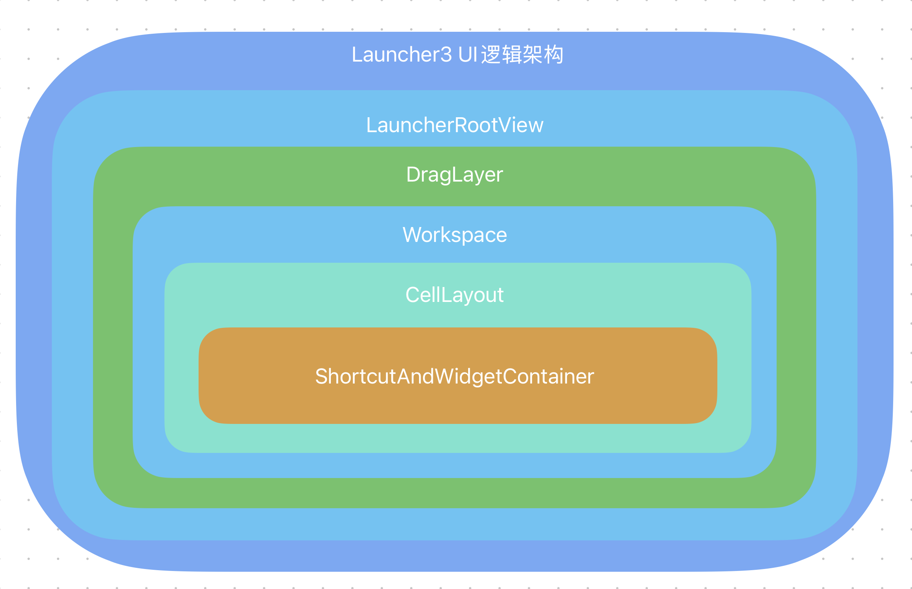
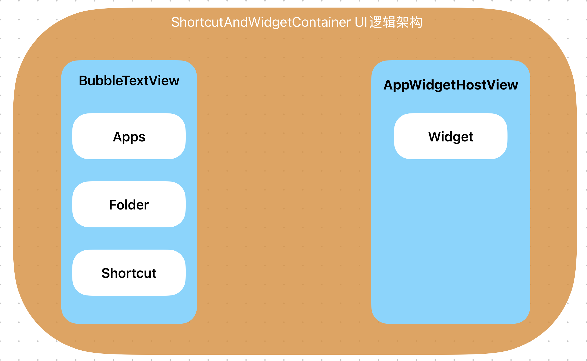
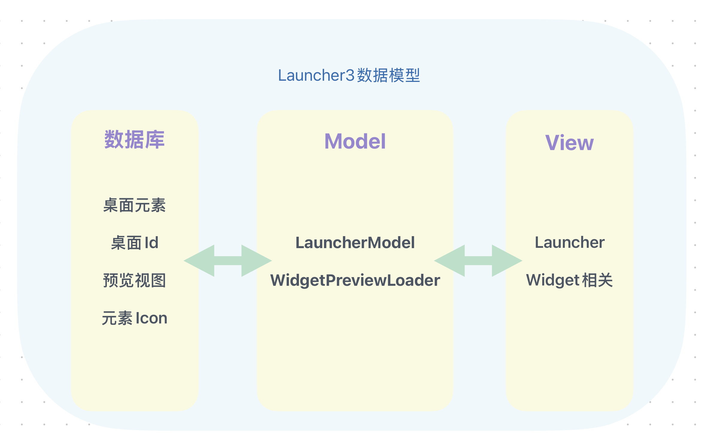
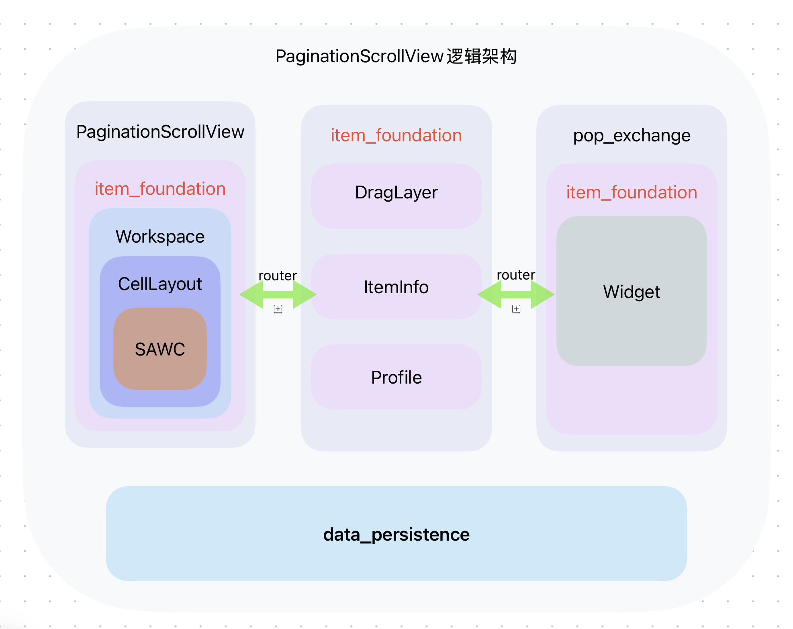

[中文版本](README.md)

[English Version](doc/README_EN.md)

# 目录

- [1. 背景](#1-背景)
- [2. 开发环境](#2-开发环境)
    - [硬件环境](#硬件环境)
    - [软件环境](#软件环境)
    - [开发工具](#开发工具)
- [3. Launcher3回顾](#3-launcher3回顾)
    - [3.1 UI架构](#31-ui架构)
    - [3.2 数据架构](#32-数据架构)
- [4. 结构拆分](#4-结构拆分)
    - [4.1 功能转换](#41-功能转换)
        - [4.1.1 数据持久化](#411-数据持久化)
        - [4.1.2 Widget裁剪](#412-widget裁剪)
        - [4.1.3 文件夹](#413-文件夹)
        - [4.1.4 Shortcut](#414-shortcut)
        - [4.1.5 应用状态](#415-应用状态)
        - [4.1.6 应用图标](#416-应用图标)
- [5. 可以做什么](#5-可以做什么)
- [6. 怎么用](#6-怎么用)
- [7. 待完善的功能](#7-待完善的功能)
- [8. 其他](#8-其他)
- [9. License](#9-license)
    - [许可证说明](#许可证说明)
    - [版权声明](#版权声明)

# 1. 背景
智能座舱桌面一般在Android AOSP Launcher3源码上做定制开发，但Launcher3代码过于复杂，
定制开发成本较高。为了降低定制开发成本，本项目基于Launcher3代码，将其拆分成几个单独的module，可以单独定制开发。

在Vibe Coding盛行的背景下，本项目的定制开发显得有些多余，或有些愚蠢，其实我也是这么想的，但将Launcher3导入Cursor，给出具体需求之后
Cursor并不能很好的降低开发难度或理解整个项目或部分功能点的上下文逻辑。

于是在编程辅助工具（TRAE）下，完成了这个项目初始版本。

# 2. 开发环境

硬件环境：
- 全志H618开发板
- 2GB DDR3内存
- 16GB eMMC存储

软件环境：
- Android 12.0

开发工具：
- Android Studio Otter 2 Feature Drop | 2025.2.2
- Mac Pro Tahoe
- Gradle 8.13
- JVM-openjdk version "17.0.17" 2025-10-21 LTS

# 3. Launcher3回顾

## 3.1 UI架构




这里将桌面所有元素聚合在一个视图中，导致追踪一个视图类型的问题，通常
需要顺带排除其他类型，包含UI和逻辑。

## 3.2 数据架构



MVP架构下，在Model中除了加载基本的item元素数据，还有icon缓存等数据也在此一并获取。
最终都回调给Launcher这个类或Widget相关视图中处理。

# 4. 结构拆分

最初的设想是将Launcher3拆分成几个module，每个module负责一个功能点，如应用图标、Widget等。
但在实际拆分过程中，发现Launcher3的代码结构比较复杂，拆分起来比较困难，例如桌面图标和Widget都依赖DragLayer这个类，
放到一个module中，整体复杂度并未降低。

于是，将其拆分成如下几个module:

- item_foundation: 负责item元素的基础数据结构和逻辑，如图标、文本等,DragLayer也在这个module中，
作为基础视图，用于承载应用icon和Widget的拖拽。
- PaginationScrollView: 负责分页滚动视图的实现，包括分页切换、位置预测等行为。
- pop_exchange：将Widget视图的生成，底部Widget列表实现等功能。
- data_persistence: 负责数据的持久化，如应用图标、Widget等数据的存储和读取。
- router:跨module方法调用。
- utils: 负责一些通用的工具类，如日志、线程池等。

整体逻辑架构如下：



## 4.1 功能转换

### 4.1.1 数据持久化

原生Launcher3中，依赖
ContentProvider做数据处理，这里保持不变，但舍弃原有逻辑，重新规整，将数据增删改查逻辑抽象，
放到一个集中的地方处理，避免感官上的混乱。

### 4.1.2 Widget裁剪

Widget涉及数据读取，预览视图生成，拖动排挤，删除等功能。这里将核心功能抽出，不再放到跟桌面icon中处理。
对于一般座舱桌面开发来说，不太关心CustomWidget，这里做删除。

### 4.1.3 文件夹

文件夹功能在目前接触到的座舱项目中，用到的比较少，这里先不实现。

### 4.1.4 Shortcut

快捷方式，这里直接用应用icon，指定应用启动Activity即可。

### 4.1.5 应用状态

就当前接触的项目来说，系统都有自己的应用商店，一般都不会对接原生安装器去分发
应用状态，比如安装，更新，卸载等。这里直接舍弃，直接通过提供的数据操作类即可实现新增，更新，删除。

### 4.1.6 应用图标

图标在原生Launcher3中通过IconCache DB实现缓存，这里直接放到一张表中处理。

# 5. 可以做什么

- 分页滚动视图
- Widget列表

这两个功能覆盖了座舱桌面80%的使用场景，既可以做单独的应用列表，实现左右分页，拖拽换页，也可以做Widget列表，实现编辑Widget或拖拽Widget新增删除。

当前项目，开发人员只需要关注数据组装，UI实现即可，无需关注数据层面。

# 6. 怎么用

在首页中，可以像如下代码设置：

```java
//定义icon的行数和列数
final int row = 3;
final int column = 5;

// 获取屏幕分辨率
DisplayMetrics displayMetrics = new DisplayMetrics();
if (Build.VERSION.SDK_INT >= Build.VERSION_CODES.JELLY_BEAN_MR1) {
    getWindowManager().getDefaultDisplay().getRealMetrics(displayMetrics);
} else {
    getWindowManager().getDefaultDisplay().getMetrics(displayMetrics);
}

//获取屏幕宽度和高度，然后分别除以行数和列数，得到每个icon的宽度和高度
int screenWidth = displayMetrics.widthPixels;
int screenHeight = displayMetrics.heightPixels;
LogUtils.d(TAG, "device screen size: " + screenWidth + "x" + screenHeight);

PaginationProfile paginationProfile = (PaginationProfile) new PaginationProfile.Builder()
        .setHeightPx(screenHeight)//设置分页滚动视图的高度为屏幕高度
        .setWidthPx(screenWidth)//设置分页滚动视图的宽度为屏幕宽度
        .setCellHeightPx(360)//设置每个icon的高度为360px，视图高度/行数
        .setCellWidthPx(384)//设置每个icon的宽度为384px，视图宽度/列数
        .setNumColumns(column)//设置分页滚动视图的列数为5
        .setNumRows(row)//设置分页滚动视图的行数为3
        .setIconDrawablePaddingPx(2)//设置每个icon与text的间距为2px
        .setDefaultPageSpacingPx(2)//设置分页滚动视图的默认分页间距为2px
        .setEdgeMarginPx(2)//设置分页滚动视图的边缘间距为2px
        .setIconSizePx(108)//设置每个icon的大小为108px
        .setIconTextSizePx(16)//设置每个icon的文本大小为16px
        .setCellTextColor(getColor(R.color.black))//设置每个icon的文本颜色为黑色
        .setWorkspacePadding(new Rect(0, 0, 0, 0))//设置分页滚动视图的工作空间padding为0px
        .setSaveDataInDb(true)//设置是否保存数据到DB，默认false
        .build();

setContentView(R.layout.activity_main);
//获取分页滚动视图实例
PaginationScrollView paginationScrollView = findViewById(R.id.pagination_scroll_view);
//初始化Widget列表弹窗视图，如果不需要可以注释
PopUpExchangeView.getInstance().init(this);

//从SharedPreferences中获取数据是否保存到DB的状态，如果需要保存到DB，就判断当前是否要读取缓存数据
//如果不需要保存到DB，就直接绑定数据
SharedPreferences sharedPreferences = getSharedPreferences("PaginationScrollView", MODE_PRIVATE);
boolean dataSaved = sharedPreferences.getBoolean("data_saved", false);
if (dataSaved) {
    paginationScrollView.bindItems();
} else {
    paginationScrollView.bindItems(fruits);
    sharedPreferences.edit().putBoolean("data_saved", true).apply();
}

//设置Widget列表弹窗视图的点击事件，点击后显示或关闭弹窗，如果不需要Widget列表，则注释这部分代码
FloatingActionButton popupButton = findViewById(R.id.show_pop_window);
popupButton.setOnClickListener(v -> {
    PopUpExchangeView.getInstance().showOrClosePopWindow();
});
```

# 7. 待完善的功能

- item及Widget数据的删除，更新

# 8. 其他

- 根据item操作记录，添加数据打点，用于分析用户行为。
- 基于行为数据，添加AI推荐功能。
- 基于地理围栏，添加AI智能推荐功能。
- 数据合规。

# 9. License
本项目的开源部分使用Apache License 2.0许可证。核心功能以混淆的AAR形式提供，遵循Apache License 2.0的条款。

## 许可证说明

- 开源代码部分：遵循Apache License 2.0许可证，允许自由使用、修改和分发
- 核心AAR模块：以二进制形式提供，同样遵循Apache License 2.0的条款
- 商业使用：允许商业使用，无需开源您的修改

## 版权声明

Copyright 2025 [查克陈或Chuck或ChuckChan为名称的自媒体渠道]

Licensed under the Apache License, Version 2.0 (the "License");
you may not use this file except in compliance with the License.
You may obtain a copy of the License at

    http://www.apache.org/licenses/LICENSE-2.0

Unless required by applicable law or agreed to in writing, software
distributed under the License is distributed on an "AS IS" BASIS,
WITHOUT WARRANTIES OR CONDITIONS OF ANY KIND, either express or implied.
See the License for the specific language governing permissions and
limitations under the License.


